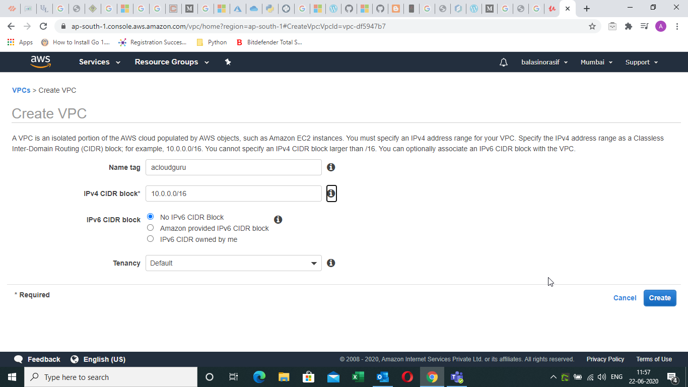

# VPC

### Creating VPC

#### Creating the VPC

#### Creating a Subnet

#### Auto Assigning IP Addresses

Click on Auto-Assign IP4

#### **Creating an Internet Gateway\(IGW\)**

 Create an IGW. All it takes is adding a name. 

By default the IGW has the status of **Detached**

We need to attach the IGW to our created VPC. Select the IGW , go to action and select attach to VPC 

#### Create a Separate Route Table

We create a separate route table. 

Edit routes in the route table

We now get a Route out to the internet. Any sub nets associated with this route table will be publicly available. 

We will go to Subnet Associations and click on Edit Subnets. We will add the subnet 10.0.1.0 to our Public Route table

We will create 2 EC2 instances. While creating the instance we will select the VPC that we created. For the public instance we will select the public subnet and for the private instance we will select the private subnet. 

\*\*\*\*

